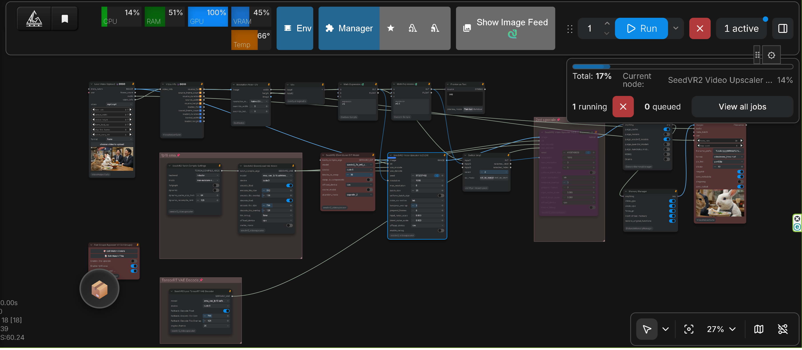
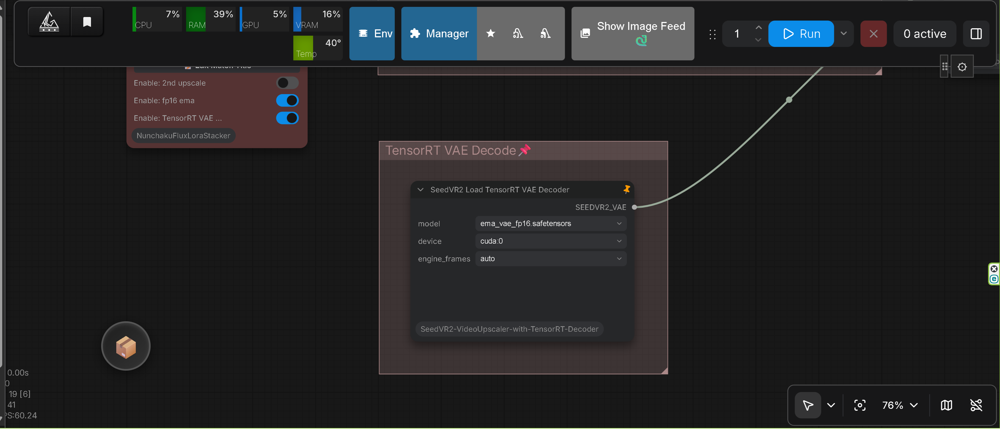

# ComfyUI-SeedVR2_VideoUpscaler

Official release of [SeedVR2](https://github.com/ByteDance-Seed/SeedVR) for ComfyUI that enables high-quality video and image upscaling.

## Documentation

For details, refer to the official repository:

https://github.com/numz/ComfyUI-SeedVR2_VideoUpscaler
